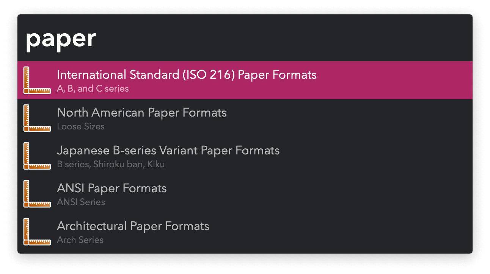
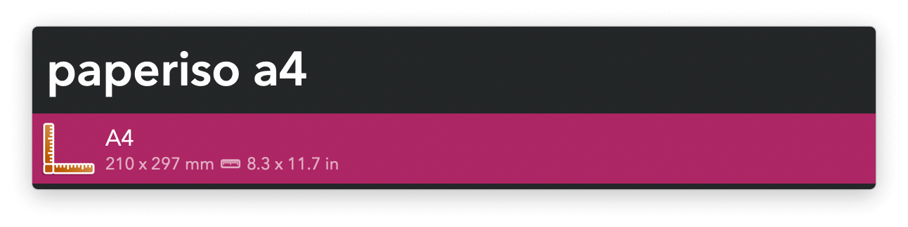

#  Paper Formats Alfred Workflow

Reference International Paper Formats

[⤓ Install on the Alfred Gallery](https://alfred.app/workflows/vitor/paper-formats)

## Usage

Reference international paper formats via the keywords:

* `paperiso` International Standard (ISO 216) Paper Formats.
* `paperna` North American Paper Formats.
* `paperjis` Japanese B-series Variant Paper Formats.
* `paperansi` ANSI Paper Formats.
* `paperarch` Architectural Paper Formats.

Keywords can be customised in the [Workflow’s Configuration](https://www.alfredapp.com/help/workflows/user-configuration/), as well as the sizes (millimetres or inches) to copy when pressing <kbd>↩&#xFE0E;</kbd> (default format) or <kbd>⌥</kbd><kbd>↩&#xFE0E;</kbd> (alternative format).
